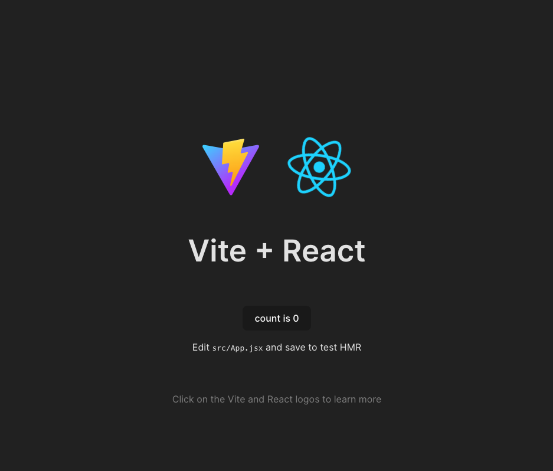
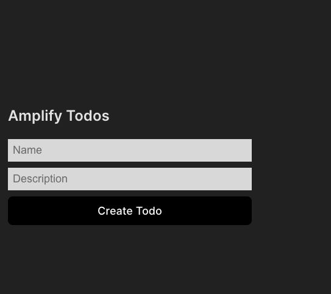
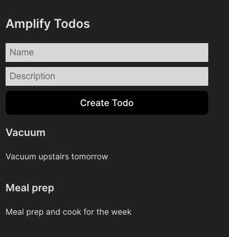
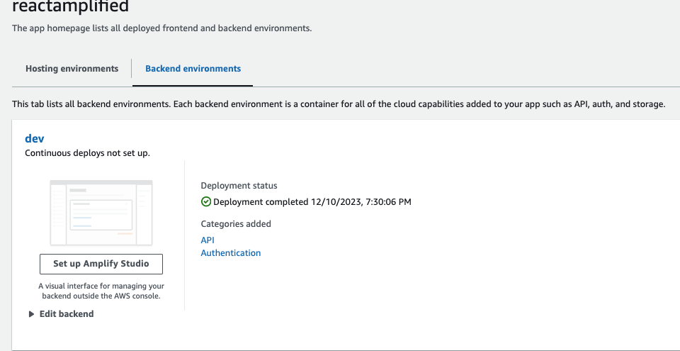
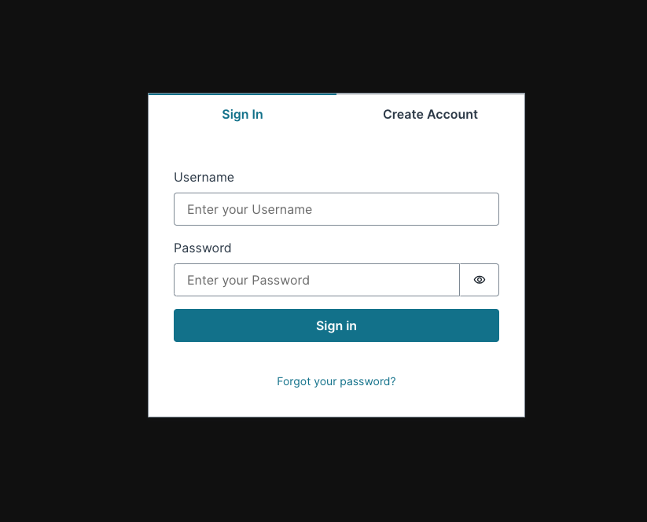
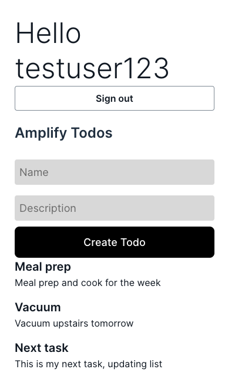

# Amplify Project

This is a quick build out of a Todo app following the AWS documentation using Amplify and React.

## Table of Contents

- [Introduction](#introduction)
- [Features](#features)
- [Prerequisites](#prerequisites)
- [Getting Started](#getting-started)
- [Steps](#steps)
- [Acknowledgments](#acknowledgments)

## Introduction

I am doing a walk through of Amplify to learn to how to implement the tool and some of the features for other projects.

## Features

The main features of this project are using the AWS CLI, setting up an Amplify User with permissions, setting up a database for the backend of this app, and authentication.

## Prerequisites

Outline any prerequisites or dependencies that need to be installed before running the project.

- Node.js
- npm or yarn
- AWS Amplify CLI (if not globally installed)

## Getting Started

Provide instructions on how to clone the repository and set up the project locally.

```bash
git clone <repository-url>
cd project-directory
npm install -g @aws-amplify/cli
amplify configure
npm create vite@latest
✔ Project name: react-amplified
✔ Select a framework: › React
✔ Select a variant: › JavaScript
npm install   # or yarn install
npm run dev
amplify init
```



- Make sure to edit the configuration after running amplify init so that the distribution directory path : dist

## Steps

1. After running the commands above you should have a react-amplified root directory with sub directories: amplify, node_modules, public, src.
2. So I'm running everything from with the root directory from here on out.
3. Run `npm install aws-amplify` to add the main amplify library to your project.
4. Set up frontend by opening up src/main.jsx and adding :

```
import { Amplify } from 'aws-amplify';
import amplifyconfig from './amplifyconfiguration.json';
Amplify.configure(amplifyconfig);
```

5. Next we will add a GraphQL API to the app and automatically provision a database that will store our Todo's `amplify add api`. You can configure the schema with the following code:

```
input AMPLIFY {
  globalAuthRule: AuthRule = { allow: public }
} # FOR TESTING ONLY!
type Todo @model {
  id: ID!
  name: String!
  description: String
}
```

6. Then deploy using `amplify push`.

   
   

7. Update src/App.jsx with the following code to build out the Todo List UI, including useState, fetching the newly built out API, and add styling. (Refer to my src/App.jsx if you need easy code to follow). Then run locally to see `npm run dev`.
8. Authentication can be set up easily but will require some configuration within AWS Cognito. You'll need to set up a user with a username and password to complete the steps below.
9. Run `amplify add auth` to add authentication to the Todo app
10. Select default configuration when prompted and choose username for the sign in option.
11. Run `amplify push` to push updates to amplify console. Verify updates by running `amplify console` where you can see we now have authentication and API added to the react-amplified project.



12. Add Amplify UI components with `npm install @aws-amplify/ui-react`. Add `import { withAuthenticator, Button, Heading } from '@aws-amplify/ui-react';
import '@aws-amplify/ui-react/styles.css';` to the src/App.jsx file.
13. Lastly, add this code to implement the authentication to the Todo list app, wrap the App with the withAuthenticator component on export and run `npm run dev`.



14. Adding another task after authenticating with Cognito user.



## Acknowledgements

Amplify Dev Center documentation - https://docs.amplify.aws/react/start/getting-started/setup/
